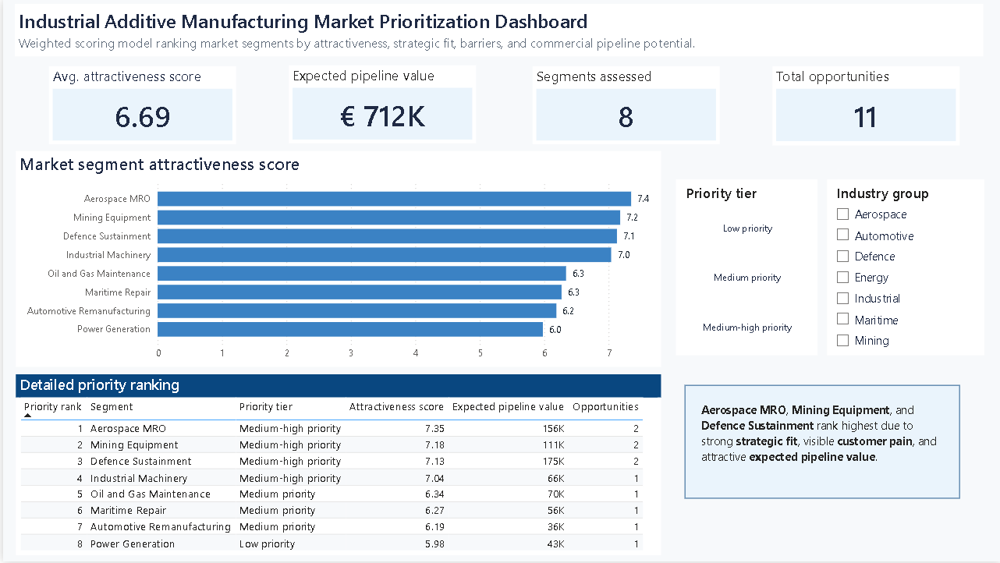

# Industrial Additive Manufacturing Market Prioritization Dashboard

## Project overview

This project ranks industrial additive manufacturing market segments using a weighted scoring model built with SQL and visualized in Power BI.

The dashboard is designed as a decision-support tool for evaluating which market segments should be prioritized based on attractiveness, strategic fit, adoption barriers, and commercial pipeline potential.



## Business problem

Industrial additive manufacturing companies often face many possible market opportunities across sectors such as aerospace, defence, mining, energy, maritime, and industrial machinery.

The challenge is not only identifying attractive markets, but comparing them consistently using clear decision criteria.

This project answers:

**Which market segments should be prioritized for commercial focus?**

## Tools used

- SQL
- Power BI
- GitHub
- CSV-based dummy data
- Weighted scoring model

## What this project demonstrates

- Built a weighted market prioritization model using SQL.
- Joined multiple dummy datasets into a structured scoring output.
- Translated commercial criteria into a decision-support dashboard.
- Used Power BI to visualize market attractiveness, pipeline value, and segment-level priorities.
- Documented the workflow in a reproducible GitHub repository.

## Data structure

The project uses four dummy input datasets:

| File | Purpose |
|---|---|
| `segments.csv` | Defines the market segments and industry groups |
| `market_indicators.csv` | Contains market size, growth, margin, competition, and regulatory scores |
| `scoring_inputs.csv` | Contains strategic fit, customer pain, sales accessibility, case evidence, and feasibility scores |
| `opportunities.csv` | Contains dummy commercial pipeline opportunities by segment |

## Scoring model

The SQL model combines market and commercial criteria into one attractiveness score.

The weighted score includes:

- Market size
- Growth potential
- Margin potential
- Competitive intensity
- Regulatory barriers
- Strategic fit
- Customer pain
- Sales accessibility
- Case evidence
- Implementation feasibility
- Expected pipeline value

The final output ranks segments from highest to lowest priority.

## Key dashboard insights

In this dummy scenario, the highest-ranked segments are:

1. Aerospace MRO
2. Mining Equipment
3. Defence Sustainment

These segments rank highest due to strong strategic fit, visible customer pain, and attractive expected pipeline value.

## Repository structure

```text
industrial-market-prioritization-dashboard/
├── data/
│   ├── raw/
│   └── processed/
├── powerbi/
├── screenshots/
├── sql/
├── .gitignore
└── README.md