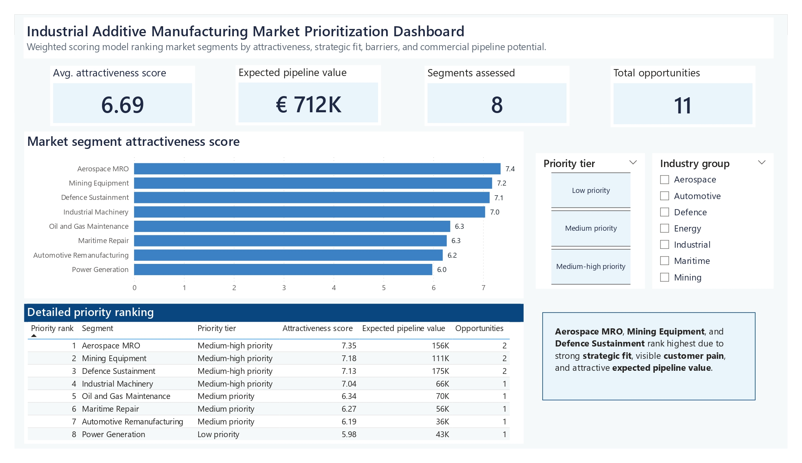
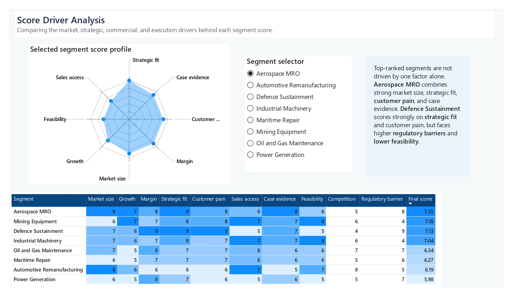

# Industrial Additive Manufacturing Market Prioritization Dashboard

> Synthetic data note: this project uses synthetic data created for portfolio purposes. The rankings are illustrative and should not be interpreted as real market recommendations or proprietary company analysis.

## Project overview

This project builds a decision-support workflow for comparing industrial additive manufacturing market segments.

The goal is to take commercial, strategic, market, and execution signals, translate them into a transparent prioritization score, and visualize the output in Power BI.

## Dashboard pages

### Market prioritization overview



### Opportunity vs barrier matrix


### Score driver analysis



Full dashboard export: [`docs/market_prioritization_dashboard.pdf`](docs/market_prioritization_dashboard.pdf)

## Business problem

Industrial additive manufacturing companies can pursue many possible markets, including aerospace, defence, mining, energy, maritime, and industrial machinery.

The challenge is not only finding attractive markets, but comparing them consistently. A segment may look attractive because of market size, but still be difficult to enter because of regulation, procurement complexity, low accessibility, or limited commercial evidence.

This project asks:

**Which market segments should receive commercial focus first?**

## Tools used

- SQL
- Power BI
- GitHub
- CSV-based synthetic data
- Weighted scoring model

## What I focused on

- Structuring a market prioritization problem into clear scoring criteria
- Joining multiple input tables into a final scored output
- Using SQL to calculate rankings, opportunity classifications, and data quality checks
- Building a multi-page Power BI dashboard for commercial decision support
- Creating views for prioritization, opportunity barriers, pipeline concentration, and score drivers
- Documenting the workflow clearly enough for someone else to inspect it

## Data structure

The project uses four synthetic input datasets:

| File | Purpose |
|---|---|
| `segments.csv` | Defines the market segments and industry groups |
| `market_indicators.csv` | Contains market size, growth, margin, competition, and regulatory scores |
| `scoring_inputs.csv` | Contains strategic fit, customer pain, sales accessibility, case evidence, and feasibility scores |
| `opportunities.csv` | Contains synthetic commercial pipeline opportunities by segment |

## Scoring model

The SQL model combines market and commercial criteria into one attractiveness score.

The score includes:

- Market size
- Growth potential
- Margin potential
- Competitive intensity
- Regulatory barriers
- Strategic fit
- Customer pain
- Sales accessibility
- Case evidence
- Implementation feasibility
- Expected pipeline value

The final output ranks segments from highest to lowest priority.

## Dashboard logic

The Power BI dashboard contains three pages:

1. **Market prioritization overview**  
   Ranks segments by attractiveness score and shows key portfolio-level metrics.

2. **Opportunity vs barrier matrix**  
   Compares attractiveness, adoption barriers, and expected pipeline value to classify segments as quick wins, strategic bets, or selective opportunities.

3. **Score driver analysis**  
   Shows the underlying score components behind each segment ranking and includes a selected-segment radar profile.

## Key observations from the synthetic scenario

In this synthetic scenario, the highest-ranked segments are:

1. Aerospace MRO
2. Mining Equipment
3. Defence Sustainment

These segments rank highest because they combine strong strategic fit, visible customer pain, and attractive expected pipeline value.

The opportunity vs barrier matrix adds a second layer of interpretation. Aerospace MRO and Mining Equipment appear as quick wins, while Defence Sustainment is more attractive as a strategic bet because of higher adoption barriers.

The model should not be read as a final market recommendation. It is a structured way to compare options, surface trade-offs, and support commercial prioritization discussions.

## Repository structure

```text
industrial-market-prioritization-dashboard/
|-- data/
|   |-- raw/
|   |-- processed/
|-- docs/
|-- powerbi/
|-- screenshots/
|-- sql/
|-- .gitignore
|-- README.md